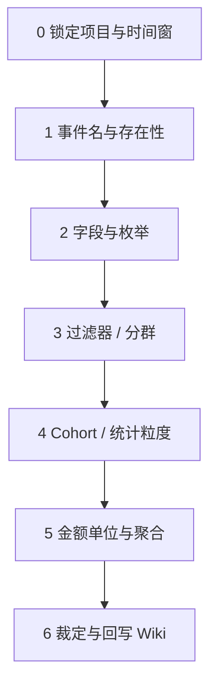

# 何时启用

以下任一条成立，**不得**静默选一方，须走本 Checklist 并建/更新 [Conflict](/synthesis/conflicts/)（`status: open`）：

- Wiki Event/Metric 与盘古 MCP `list_event_properties` / `list_dimensions` 不一致
- TE `query_adhoc` 结果与 Wiki Metric 定义或既有报表对不上
- 本地 raw / 旧文档 / 行业手册与项目 [metric-implementation](/projects/temperedheroes/metric-implementation.md) 冲突
- 用户陈述与任一权威来源冲突

权威分层见 [authority-and-conflicts.md](../../../info/conventions/authority-and-conflicts.md)、[te-analysis-policy](/synthesis/te-analysis-policy.md)。

# 裁定顺序（由底向上）

按顺序排除；**前一步未对齐，不要跳到后一步**。



## Step 0 — 锁定上下文

| 检查项 | 做法 | 通过标准 |
|--------|------|----------|
| 项目 | 确认盘古 `project_id`、TE `projectId`（百炼：**69 ≠ 101**） | 两 ID 已写明 |
| 时间窗 | 起止日期、时区、是否自然日 | 与争议报表一致 |
| 争议类型 | 协议 / 定义 / 数值 / 过滤器 | 已分类 |

## Step 1 — 事件名与存在性

| 检查项 | 权威 | 工具 / 文档 |
|--------|------|-------------|
| 生产事件名 | **盘古 MCP** | `list_events(project_id)` |
| TE 是否同名 | TE 为辅 | `list_events(projectId)` — **不替代**盘古 ingest |
| Wiki 模板名 | 仅抽象 | `LoginEvent` / `PayEvent` ≠ 百炼生产名 `t_login` / `t_pay_flow` |

**常见根因**：用模板名跑 TE；TE 独有 `m_*` 事件被当成协议事件。

**通过标准**：各方列出的 **event_name 集合**一致，或已记录「仅 TE 衍生、非协议」。

## Step 2 — 字段与枚举

| 检查项 | 权威 | 工具 |
|--------|------|------|
| 属性列表、类型、必填 | **盘古 MCP** | `list_event_properties` |
| 枚举 key/value | **盘古 MCP**（现查） | `get_dimension_info(name=…)` |
| Wiki 快照 | 策展 | L1 目录 + pin 页 `last_verified` |

**常见根因**：Wiki 未 refresh（如缺字段）；pin 枚举过期；把配置中心枚举当埋点枚举。

**通过标准**：专有字段 diff 为空，或 diff 已写入 Wiki / Conflict；dim 字段已注明枚举大类名。

## Step 3 — 过滤器 / 分群

| 检查项 | 权威 | 文档 |
|--------|------|------|
| 「平台 / 渠道 / 区服」用哪个字段 | **项目 filter-registry** | [temperedheroes filter-registry](/projects/temperedheroes/filter-registry.md) |
| TE 过滤器是否生效 | **TE 跑数** | 样本为 0 时停 — 见 [platform vs area_id Conflict](/synthesis/conflicts/temperedheroes-platform-filter-vs-area-id.md) |
| Segment / 标签 | Wiki + TE | 标签条件与事件 filter 并列核对 |

**常见根因**：`platform` 用户属性与事件属性 `platform` 混用；枚举值大小写/命名与 TE 不一致；AB 双条件冗余导致 0 样本。

**通过标准**：过滤器与 [metric-implementation](/projects/temperedheroes/metric-implementation.md) 或 open Conflict **临时规则**一致。

## Step 4 — Cohort / 统计粒度

| 检查项 | 权威 | 说明 |
|--------|------|------|
| 指标定义（注册日 / 活跃日 / 付费日） | **Wiki Metric** | `# Definition` + 项目 implementation |
| TE 留存/漏斗 initialEvent | **TE QP** | `initialEvent` / `returnEvent` 可能与 Wiki 措辞不同 |
| 行业参考 | 非强制 | [industry-glossary-policy](/synthesis/industry-glossary-policy.md) |

**常见根因**：D1 用「注册日 T」vs 行业「首日新增」vs TE builder 另一初始事件 — 见 [d1-cohort Conflict](/synthesis/conflicts/d1-cohort-industry-vs-wiki.md)。

**通过标准**：Metric 页或 Conflict 已写明 **cohort 日 = 哪一事件哪一天**；TE QP 摘要可复现。

## Step 5 — 金额单位与聚合

| 检查项 | 权威 | 说明 |
|--------|------|------|
| 金额字段 | 盘古字段名 + Wiki 约定 | 百炼 ARPU 分子：**`generalcost`**（非 `cost`） |
| 单位（分/厘/元） | **数据组裁定** | 未确认前禁止向业务报「元」 |
| 聚合方式 | Wiki + TE | `sum` / `user_count` / 公式指标 |

**通过标准**：金额字段、单位、分母事件已在 Wiki 或 Conflict 中 **resolved** 或标注 open。

## Step 6 — 裁定与回写

| 动作 | 负责 |
|------|------|
| 更新 Conflict：`status: resolved` + `resolution` 正文 | 数据组 |
| 修订 Metric / Event / Playbook / filter-registry | Agent（用户授权）或数据组 |
| 若协议变更 | 盘古需求/MCP 流程 — **非**仅改 Wiki |
| 更新 `log.md` + 相关 `index.md` | Agent ingest 后 |

# Conflict 页最小模板

```yaml
---
type: Conflict
title: …
status: open          # resolved 时改
parties: [Wiki, 盘古 MCP, TE, …]
project_id: …         # 可选
resolution: …         # resolved 时必填
timestamp: …
---
```

正文建议四段：**差异表** → **可能影响** → **临时规则（Agent 用）** → **建议裁定**。

# Agent 作答红线（摘要）

与 [guardrails](/synthesis/temperedheroes-analytics-guardrails.md) 一致：

1. open Conflict **不得**作唯一口径依据
2. `status: draft` 页须声明
3. 带数答案须附 projectId、时间窗、QP/报表来源
4. 宁可「待确认」，不可猜

# 例行维护

| 节奏 | 动作 |
|------|------|
| 版本上线 / 新需求埋点 | ingest + MCP diff |
| 季度 / 用户说「lint」 | [workflow lint](../../../.cursor/skills/th-bi-analytics-assistant/references/workflow-v1.md) D1–D5 |
| 枚举大类变更 | [pango-dimension-catalog-policy](/synthesis/pango-dimension-catalog-policy.md) refresh L1 |
| Playbook 引用的 enum pin | 检查 `last_verified` |

# Citations

[1] [info/conventions/authority-and-conflicts.md](../../../info/conventions/authority-and-conflicts.md)
[2] [te-analysis-policy](/synthesis/te-analysis-policy.md)
[3] [workflow-v1 lint](../../../.cursor/skills/th-bi-analytics-assistant/references/workflow-v1.md)
